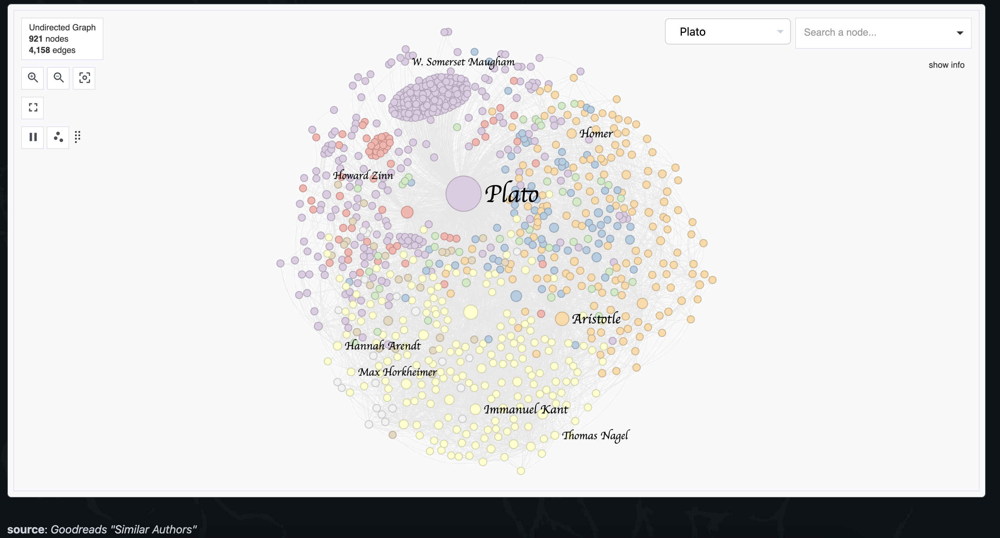
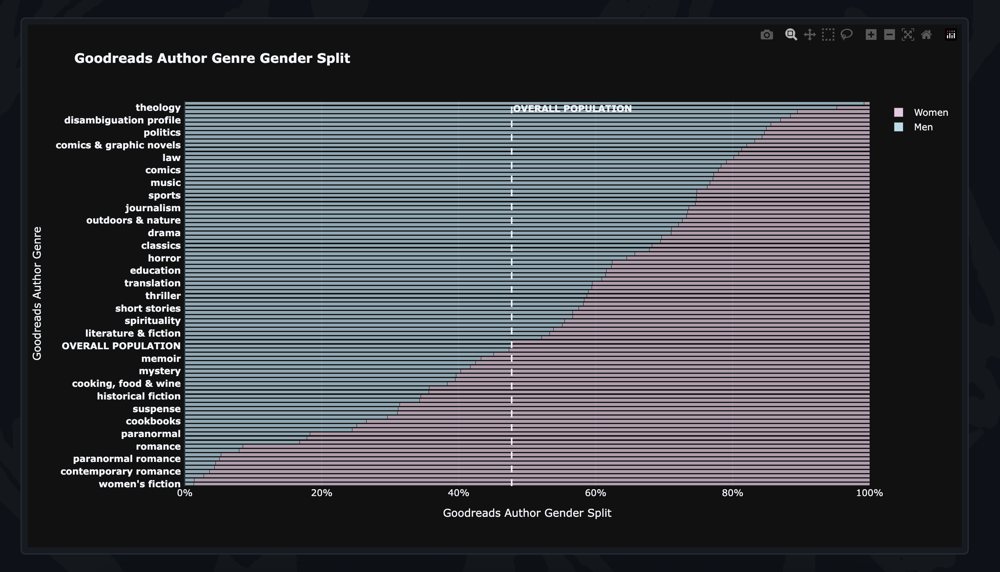
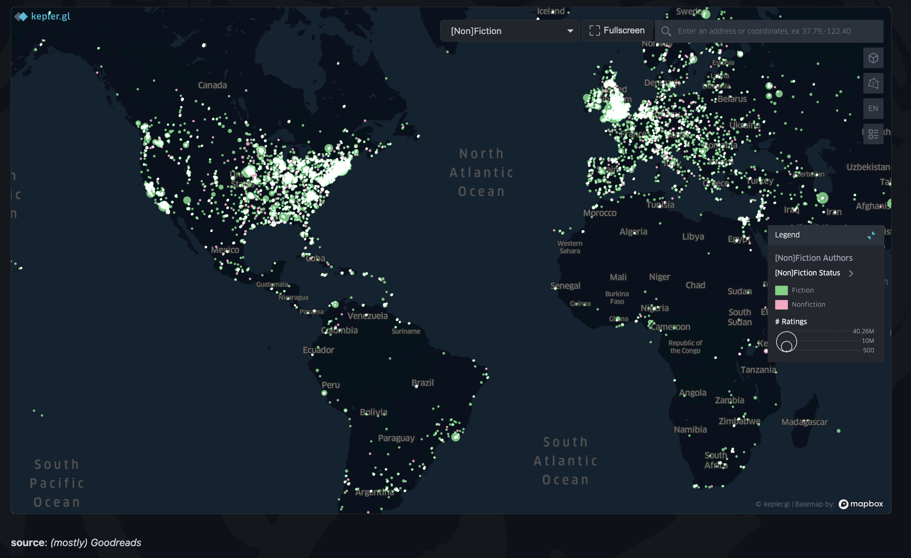
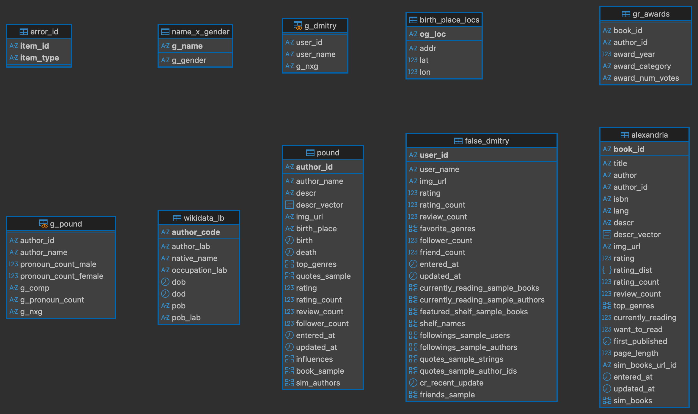

# guide2kulchur


## description
`guide2kulchur` is a project focused on studying the reading and writing patterns across the world, along a number of dimensions like time, geography and genre. `guide2kulchur` specifically is focused on the data collection for this project, primarily from Goodreads. Goodreads has a rich set of book, author and user data, and the social interactions between each of these sources, making it perfect for this sort of project. Obviously, none of the data pulled here is used for commercial purposes.

## [guide2kulchur.xyz](https://guide2kulchur.xyz)
You can see the fruits of this project at [guide2kulchur.xyz](https://guide2kulchur.xyz), including interactive visualizations on the data collected. See below for a preview of the visualizations:







You can look at the [Methods](https://guide2kulchur.xyz/info/methods.html) and [About](https://guide2kulchur.xyz/info/about.html) pages for more information.

## repository
There are a number of directories in this repository; below are the most important:

- [guide2kulchur](./guide2kulchur/): the actual library created for pulling goodreads data, parsing it, and loading it into a Postgres database; includes two subdirectories:
    - [privateer](./guide2kulchur/privateer/): pulling publicly available book/author/user data from Goodreads, and parsing a number of fields
    - [engineer](./guide2kulchur/engineer/): pulling data in a structured manner, and loading it into a database
- [scripts](./scripts/): the actual scripts ran throughout this process; includeds the following subdirectories:
    - [goodreads-choice-awards](./scripts/goodreads-choice-awards/): used to pull annual Goodreads Choice Awards data; you can see the final results in the [data/goodreads-choice-awards](./data/goodreads-choice-awards/) directory
    - [main-pipeline](./scripts/main-pipeline/): the most important set of scripts; used to actually pull the bulk of the data used in this project
    - [supplements](./scripts/supplements/): supplemental scripts made in the process, for things like log parsing or interacting with other data sources, like Wikidata
    - [ex-post](./scripts/ex-post/): scripts ran after [main-pipeline](./scripts/main-pipeline/), for things like post-processing data
    - [visuals](./scripts/visuals/): used for creating the visualizations included on [guide2kulchur.xyz](https://guide2kulchur.xyz)
- [db](./db): database schema and migration files; you can see the [inital schema](./db/init_schema.sql), and the [number of changes](./db/migrations/) made throughout the way. You can see the schema visualization below (made with DBeaver). You will see that there aren't any references/connections between tables; given the nature of the data extraction, reference conditions couldn't be enforced (e.g., can't confirm that author of book "The Master and Margarita", Mikhail Bulgakov, will be present in the author data table). Nonetheless, implicit references via certain attributes can still be seen clearly, by attributes like `book_id` and `author_id` for example:



## [kulchur](https://github.com/rhawrami/kulchur/)
If you'd like to work with publicly available Goodreads data, **in a respectful and non-commerical intention**, you can use `kulchur`, the python package made through the development of this project. You can view the [repository here](https://github.com/rhawrami/kulchur/), and install with `pip`:
```bash
$ pip install kulchur
```

## contact
You can contact me at rhawrami[at]proton[dot]me for any inquiries. Thanks!
